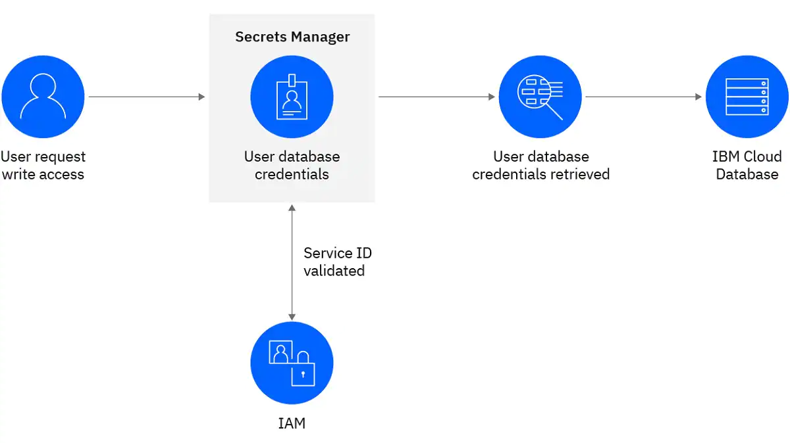

# Overview

This is a sample ansible playbook that uses IBM Cloud Secrets manager to store secrets. With Secrets Manager, you can create, lease, and centrally manage secrets that are used in IBM Cloud services or your custom-built applications. Secrets are stored in a dedicated Secrets Manager instance per customer, built on HashiCorp Vault.

## Tested with Ansible

* 2.9
* 2.10
* 2.11
* 2.12

## Python Requirements

Currently this playbook has been tested support and test against Python versions:
* 3.6
* 3.7
* 3.8

## Requirements

* IBM Cloud API key: In order to use this playbok you must have a valid  IBM Cloud API keys for services. These keys can also be stored, rotated, revoked, or even leased if you only want to provide temporary access for other team members or services. IBM Cloud API keys, in combination with the right identity and access management (IAM) policy, enable access to cloud object storage, continuous delivery and other platform services.

